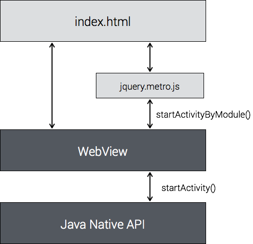
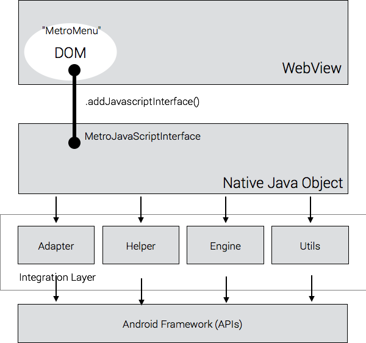

以混合應用 (Hybrid App) 方式製作 Android Launcher 的框架 

A hybrid app (WebView and HTML5) biolerplate to build Android launcher app.

# LauncherGap

LauncherGap is a free and open source framework to help front-end developers easily creating Android Launcher apps. This project can help you to build Android Launcher with JavaScript and CSS. 

Have fun with web technologies.

# Hybrid App 快速入門教程

* LauncherGap 是一個 Hybrid App 架構的 Android Launcher 開發框架，front-end 工程師，也能輕易以 JavaScript 開發 launcher

* LauncherGap 也能做為 Hybrid App 的教學範例，它展示了如何從零開始 (不使用 PhoneGap) 打造一個 Hybrid App

* 以下是一份 Hybrid App 的快速入門教程，你可以在 60 分鐘內，學會以 JavaScript 與 CSS 開發 Android Launcher，以及所需的背景知識

## 第 1 課：何謂 Hybrid App

App 的開發模式有 3 種：

* Native App－以原生 (Native) 的 SDK 方式來編寫 App。例如：原生的 Android SDK 是以 Java 來編寫 Android App。
* Web App－以 100% 的 Web 技術來編寫 App，一般為 Single-page application。
* Hybrid App－混合以上二種開發模式，能以 Web 技術來編寫 Mobile App。

Android 的 Hybrid App 編程，是以 *WebView* 組件做為中間件 (Middleware)。WebView 組件以上是 Web App 編程技術，以下是 Native App 編程技術。


Fig 1: LauncherGap 架構

圖 1 是 LauncherGap 的架構，這個架構直接說明了 HyBrid App 的架構與實現方式：

* Android 的原生 WebView 組件，是瀏覽器引擎的封裝
* 在 Android App 裡使用 WebView 來載入 HTML5 與執行 JavaScript
* *index.html* 是 App 的 UI
* 使用 WebView 將 Java object 綁定到 WebView，成為 DOM 裡面的一個 object，JavaScript 就能呼叫 DOM object，並經由該 DOM object，對應到底層的 Java object

Launcher 的基本功能是「啟動應用程式」，要實現這個功能，就要透過 Android SDK 提供的 **startActivity()** API。如架構圖以及上述觀念所示，將 **startActivity()** 經由 WebView 綁定到 DOM 成為 **startActivityByModule()** API 即可。

JavaScript 便可以透過 **startActivityByModule()** 來啟動所指定的 App。

如圖所示，為方便 frontend 開發者使用，再將 **startActivityByModule()** 封裝為 jQuery Plugin（jQuery pattern），文件名為 **jquery.metro.js**。

## 第 2 課：Hybrid App 起步走

LauncherGap 的 MetroWebView 類別，是 WebView 組件的展。在 [MetroWebView.java](src/com/launchergap/preview/tiles/MetroWebView.java) 範例中，可以找到最關鍵的程式碼實作：

```
	private void initWebView(Context context) {
        …
        this.addJavascriptInterface(new MetroJavaScriptInterface(mContext), “MetroMenu”);		
        …
	}
```

如前一課所述，**WebView.addJavascriptInterface()** 將 Java object 綁定到 DOM：

* 第 1 個參數是原生 (Native) 的 Java object 實例
* 第 2 個參數則是 DOM 的 object 實例名稱


Fig 2: LauncherGap 細部架構

接著，在 **MetroJavaScriptInterface** 類別裡設計並實現 API，例如，加入 **startActivity()** API：

```
public class MetroJavaScriptInterface {
	…
	public void startActivityByModule() 
	{

	}
	…
}
```

如圖 2 所示，完成 Java object 到 DOM object 的綁定後，就能在 **index.html** 裡，透過 JavaScript 來呼叫：

```
MetroMenu.startActivityByModule();
```

這就是 JavaScript 與 Java 混合開發的核心觀念，[WebView.addJavascriptInterface](https://developer.android.com/reference/android/webkit/WebView.html#addJavascriptInterface(java.lang.Object, java.lang.String)) 是整個 hybrid app 的基礎建設。

## 第 3 課：Launch Apps

(未完待續)

# License

LauncherGap is dual licensed under the MIT license (below) and [Apache license](http://www.apache.org/licenses/LICENSE-2.0.html).


<small>
MIT License

Copyright (c) 2014-2016 Jollen Chen

Permission is hereby granted, free of charge, to any person obtaining a copy of this software and associated documentation files (the "Software"), to deal in the Software without restriction, including without limitation the rights to use, copy, modify, merge, publish, distribute, sublicense, and/or sell copies of the Software, and to permit persons to whom the Software is furnished to do so, subject to the following conditions:

The above copyright notice and this permission notice shall be included in all copies or substantial portions of the Software.

THE SOFTWARE IS PROVIDED "AS IS", WITHOUT WARRANTY OF ANY KIND, EXPRESS OR IMPLIED, INCLUDING BUT NOT LIMITED TO THE WARRANTIES OF MERCHANTABILITY, FITNESS FOR A PARTICULAR PURPOSE AND NONINFRINGEMENT. IN NO EVENT SHALL THE AUTHORS OR COPYRIGHT HOLDERS BE LIABLE FOR ANY CLAIM, DAMAGES OR OTHER LIABILITY, WHETHER IN AN ACTION OF CONTRACT, TORT OR OTHERWISE, ARISING FROM, OUT OF OR IN CONNECTION WITH THE SOFTWARE OR THE USE OR OTHER DEALINGS IN THE SOFTWARE.
</small>
